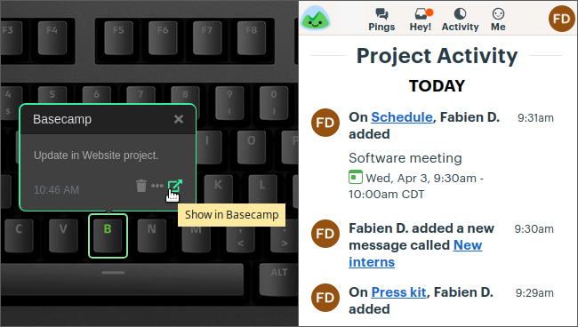

# Basecamp

Displays Basecamp 3 projects activities (new tasks, messages, meetings, etc.) on a Das Keyboard Q Series.

Basecamp is a project management tool, helping to manage
projects and collaborate with clients.

For more information about Basecamp visit <https://www.basecamp.com>.

> This applet doesn't support Basecamp 1 & 2.

This applet uses Basecamp [API 3](https://github.com/basecamp/bc3-api).